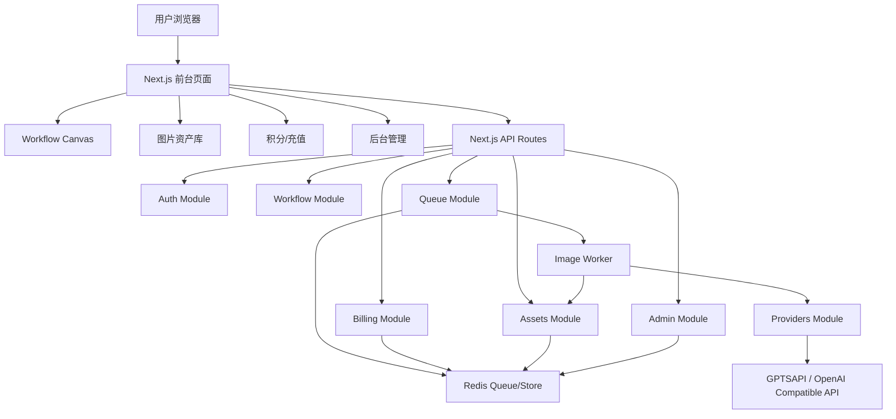
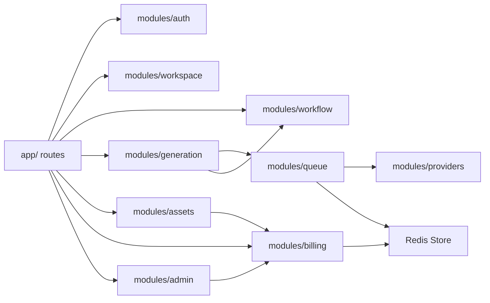
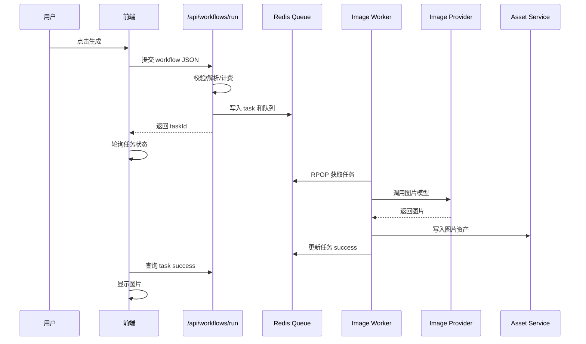
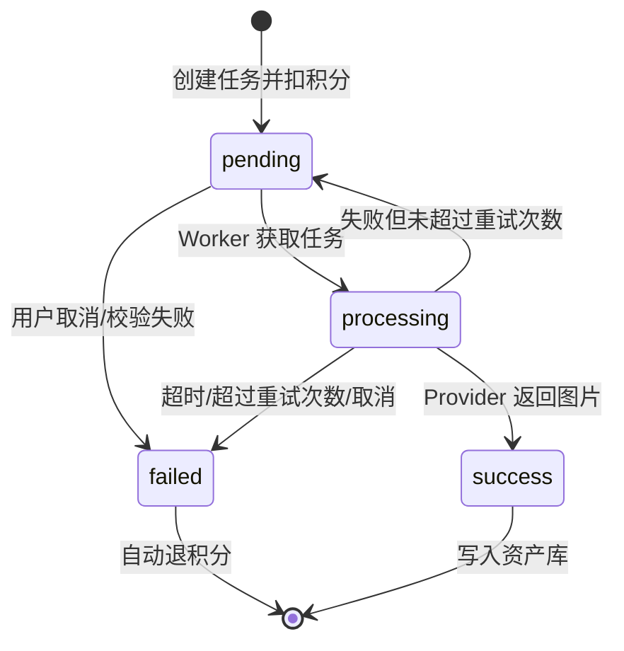
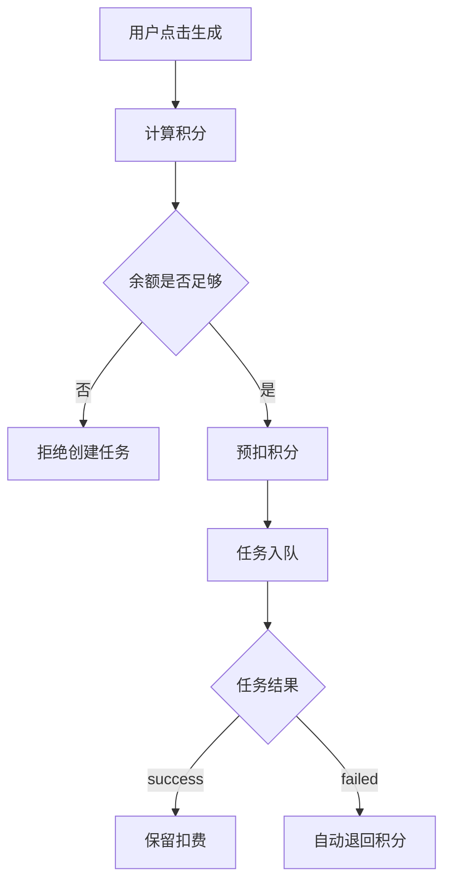
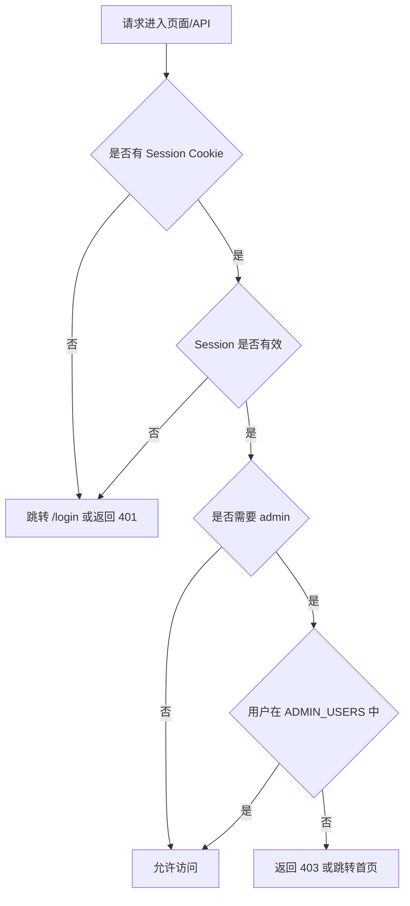

# AI 图片聚合平台完整项目开发文档

版本：v0.1  
项目形态：Next.js 模块化单体  
适用对象：产品、前端、后端、算法接入、运维、测试、运营后台开发

---

## 1. 产品需求文档 PRD

### 1.1 产品定位

本项目是一个 AI 图片生成聚合平台，面向内容创作者、设计师、电商运营、IP/潮玩团队和普通用户，提供多模型、多任务类型、多项目工作空间的图片创作能力。

平台不是单一图片生成 Demo，而是围绕“创作、生成、管理、计费、复用”的完整闭环：

- 文生图
- 图生图
- 参考图生成
- 局部重绘
- 扩图
- 高清放大
- 多图融合
- 批量生成
- 作品资产管理
- 积分计费
- 后台运营管理

### 1.2 核心用户角色

| 角色 | 说明 | 核心诉求 |
|---|---|---|
| 普通用户 | 使用平台生成图片 | 快速生成、保存、下载、收藏 |
| 创作者 | 长期维护多个创作项目 | 工作空间、项目管理、历史复用 |
| 运营人员 | 管理模型、价格、订单 | 后台管理、计费配置、日志追踪 |
| 管理员 | 平台配置与风控 | 用户管理、敏感词、模型渠道、任务监控 |

### 1.3 前台功能范围

| 模块 | 功能 |
|---|---|
| 登录注册 | 用户登录、注册、Session Cookie |
| 主页 | 平台入口、功能推荐、模板入口 |
| 模板库 | 模板展示、从模板进入工作空间 |
| 工作空间 | 项目列表、新建项目、打开、重命名、删除 |
| 创意画布 | 节点式工作流、参考图、图片生成、图片预览 |
| 图片生成节点 | 模型、提示词、比例、分辨率、精细度、风格、张数 |
| 资产库 | 我的作品、历史记录、收藏夹、下载记录、回收站 |
| 积分 | 余额展示、消耗预估、充值入口 |

### 1.4 后台功能范围

| 模块 | 功能 |
|---|---|
| 模型管理 | 启用/禁用模型、模型名称、渠道、基础积分、倍率 |
| 渠道管理 | API 基础地址、供应商、启用状态 |
| 积分计费 | 分辨率倍率、精细度倍率、参考图倍率、功能倍率 |
| 用户管理 | 用户查询、积分调整、封禁预留 |
| 充值订单 | 订单审核、通过、拒绝 |
| 任务日志 | 生成任务状态、错误、扣费、退费 |
| 敏感词管理 | 生成前提示词风控 |
| 模板管理 | 提示词模板、运营推荐模板 |

### 1.5 非功能需求

| 类别 | 要求 |
|---|---|
| 安全 | API Key 只在服务端环境变量中保存，不能暴露给前端 |
| 性能 | 图片生成必须走任务队列，不能同步阻塞用户请求 |
| 稳定性 | 支持任务重试、超时、失败退积分、失败恢复 |
| 可维护性 | 模块化单体结构，业务逻辑从 app/ 中移出 |
| 可扩展性 | 支持后续新增模型供应商和任务类型 |
| 可运营性 | 后台可配置模型、渠道、计费、敏感词、模板 |

---

## 2. 技术架构文档

### 2.1 技术栈

| 层级 | 技术 |
|---|---|
| Web 框架 | Next.js App Router |
| UI | React + TypeScript |
| 样式 | Tailwind CSS |
| 节点画布 | React Flow |
| 状态管理 | Zustand |
| 服务端接口 | Next.js Route Handlers |
| 队列/缓存 | Redis / Upstash Redis |
| 图片模型 | GPTSAPI / OpenAI Compatible Images API |
| 图片处理 | sharp |
| 鉴权 | Cookie Session |

### 2.2 系统架构图



### 2.3 模块关系图



### 2.4 模块职责

| 模块 | 职责 |
|---|---|
| modules/auth | 登录、注册、Session、用户基础能力 |
| modules/workspace | 工作空间、项目列表、项目本地保存 |
| modules/workflow | 节点画布、节点组件、工作流解析、Zustand store |
| modules/generation | 生成任务创建、状态查询、取消、任务业务服务 |
| modules/assets | 图片资产、收藏、下载、删除、恢复 |
| modules/billing | 积分、计费、充值、模型价格、平台核心数据 |
| modules/admin | 后台页面组件、后台聚合服务 |
| modules/providers | 模型供应商 API 封装 |
| modules/queue | Redis 封装、队列、Worker、重试、恢复 |

### 2.5 app/ 目录原则

`app/` 只负责：

- 页面组合
- Route Handler 入口
- 调用模块服务
- 返回 JSON 或渲染页面

`app/` 不应继续承载复杂业务逻辑。

---

## 3. 数据库设计文档

当前使用 Redis/Upstash Redis 作为数据存储。短期适合 MVP 和轻量运营；中长期建议迁移核心实体到 PostgreSQL/MySQL，Redis 保留队列和缓存。

### 3.1 Redis Key 设计

| Key | 类型 | 说明 |
|---|---|---|
| `user:{username}` | JSON | 用户信息 |
| `credits:{userId}` | Number | 用户积分余额 |
| `user:{userId}:tasks` | List | 用户任务 ID 列表 |
| `task:{taskId}` | JSON | 生成任务 |
| `platform:tasks` | List | 全平台任务 ID |
| `asset:{assetId}` | JSON | 图片资产 |
| `user:{userId}:assets` | List | 用户资产 ID 列表 |
| `recharge:{orderId}` | JSON | 充值订单 |
| `user:{userId}:rechargeOrders` | List | 用户充值订单 |
| `platform:rechargeOrders` | List | 全平台充值订单 |
| `platform:logs` | List | 平台日志 |
| `admin:models` | JSON | 模型配置 |
| `admin:channels` | JSON | 渠道配置 |
| `admin:pricingRules` | JSON | 计费规则 |
| `admin:rechargePlans` | JSON | 充值套餐 |
| `admin:sensitiveWords` | JSON | 敏感词 |
| `admin:templates` | JSON | 提示词模板 |
| `queue:image-generation:pending` | List | 图片任务队列 |
| `queue:image-generation:worker-lease` | String | Worker 分布式锁 |

### 3.2 用户表设计

未来关系型数据库建议：

```sql
CREATE TABLE users (
  id VARCHAR(64) PRIMARY KEY,
  username VARCHAR(64) UNIQUE NOT NULL,
  password_hash VARCHAR(255) NOT NULL,
  role VARCHAR(32) NOT NULL DEFAULT 'user',
  status VARCHAR(32) NOT NULL DEFAULT 'active',
  credits INT NOT NULL DEFAULT 0,
  created_at TIMESTAMP NOT NULL,
  updated_at TIMESTAMP NOT NULL
);
```

### 3.3 生成任务表设计

```sql
CREATE TABLE generation_tasks (
  id VARCHAR(64) PRIMARY KEY,
  user_id VARCHAR(64) NOT NULL,
  status VARCHAR(32) NOT NULL,
  feature VARCHAR(64) NOT NULL,
  workflow_json JSON NOT NULL,
  prompt TEXT NOT NULL,
  model VARCHAR(128) NOT NULL,
  aspect_ratio VARCHAR(32),
  resolution VARCHAR(32),
  detail VARCHAR(32),
  count INT NOT NULL DEFAULT 1,
  cost_credits INT NOT NULL,
  refunded_credits INT DEFAULT 0,
  attempts INT DEFAULT 0,
  max_attempts INT DEFAULT 3,
  timeout_ms INT DEFAULT 180000,
  cancel_requested BOOLEAN DEFAULT FALSE,
  result_json JSON,
  error TEXT,
  queued_at TIMESTAMP,
  started_at TIMESTAMP,
  finished_at TIMESTAMP,
  created_at TIMESTAMP NOT NULL,
  updated_at TIMESTAMP NOT NULL
);
```

### 3.4 图片资产表设计

```sql
CREATE TABLE image_assets (
  id VARCHAR(64) PRIMARY KEY,
  user_id VARCHAR(64) NOT NULL,
  task_id VARCHAR(64),
  image_url TEXT NOT NULL,
  mime_type VARCHAR(64),
  prompt TEXT,
  original_prompt TEXT,
  model VARCHAR(128),
  provider VARCHAR(64),
  workflow_json JSON,
  parameters_json JSON,
  reference_images_json JSON,
  favorite BOOLEAN DEFAULT FALSE,
  deleted BOOLEAN DEFAULT FALSE,
  downloaded_at TIMESTAMP,
  deleted_at TIMESTAMP,
  created_at TIMESTAMP NOT NULL,
  updated_at TIMESTAMP NOT NULL
);
```

### 3.5 充值订单表设计

```sql
CREATE TABLE recharge_orders (
  id VARCHAR(64) PRIMARY KEY,
  user_id VARCHAR(64) NOT NULL,
  plan_id VARCHAR(64) NOT NULL,
  plan_name VARCHAR(128) NOT NULL,
  credits INT NOT NULL,
  bonus_credits INT DEFAULT 0,
  total_credits INT NOT NULL,
  price_cny DECIMAL(10, 2) NOT NULL,
  status VARCHAR(32) NOT NULL,
  payment_note TEXT,
  admin_note TEXT,
  created_at TIMESTAMP NOT NULL,
  updated_at TIMESTAMP NOT NULL,
  finished_at TIMESTAMP
);
```

### 3.6 模型配置表设计

```sql
CREATE TABLE model_configs (
  id VARCHAR(128) PRIMARY KEY,
  name VARCHAR(128) NOT NULL,
  enabled BOOLEAN DEFAULT TRUE,
  channel VARCHAR(128) NOT NULL,
  base_credits INT NOT NULL,
  multiplier DECIMAL(8, 2) NOT NULL DEFAULT 1,
  resolution_multipliers_json JSON,
  detail_multipliers_json JSON,
  reference_image_multiplier DECIMAL(8, 2) DEFAULT 1
);
```

---

## 4. API 接口文档

### 4.1 鉴权说明

平台使用 Cookie Session：

- Cookie 名称：`aiwf_session`
- 登录后由服务端写入 HttpOnly Cookie
- 前端请求自动带 Cookie

### 4.2 登录

`POST /api/auth/login`

请求：

```json
{
  "username": "admin",
  "password": "admin123"
}
```

响应：

```json
{
  "ok": true
}
```

### 4.3 注册

`POST /api/auth/register`

请求：

```json
{
  "username": "new_user",
  "password": "123456"
}
```

### 4.4 当前账号

`GET /api/account/me`

响应：

```json
{
  "user": {
    "username": "admin",
    "isAdmin": true,
    "credits": 100
  },
  "tasks": []
}
```

### 4.5 提交生成任务

`POST /api/workflows/run`

说明：只提交任务，不同步生成图片。

请求：

```json
{
  "version": "1.0",
  "nodes": [],
  "edges": [],
  "targetGenerateNodeId": "generate-1"
}
```

响应：

```json
{
  "queued": true,
  "task": {
    "id": "task_123",
    "status": "pending",
    "feature": "text-to-image",
    "costCredits": 6
  },
  "billing": {
    "creditsBefore": 100,
    "creditsAfter": 94
  }
}
```

### 4.6 查询任务状态

`GET /api/tasks/{taskId}`

响应：

```json
{
  "task": {
    "id": "task_123",
    "status": "success",
    "model": "gpt-image-1.5",
    "costCredits": 6,
    "result": {
      "imageUrl": "https://example.com/image.png",
      "mimeType": "image/png",
      "provider": "openai",
      "model": "gpt-image-1.5"
    }
  }
}
```

### 4.7 取消任务

`PATCH /api/tasks/{taskId}`

请求：

```json
{
  "action": "cancel"
}
```

### 4.8 查询图片资产

`GET /api/assets?scope=works`

scope 可选：

- `works`
- `history`
- `favorites`
- `downloads`
- `trash`

响应：

```json
{
  "assets": [
    {
      "id": "asset_123",
      "imageUrl": "https://example.com/image.png",
      "prompt": "A product photo",
      "originalPrompt": "产品摄影图",
      "model": "gpt-image-1.5",
      "favorite": false,
      "deleted": false
    }
  ]
}
```

### 4.9 操作图片资产

`PATCH /api/assets/{assetId}`

请求：

```json
{
  "action": "favorite"
}
```

action 可选：

- `favorite`
- `unfavorite`
- `delete`
- `restore`
- `download`

### 4.10 计费预估

`POST /api/pricing/estimate`

请求：

```json
{
  "version": "1.0",
  "nodes": [],
  "edges": []
}
```

响应：

```json
{
  "costCredits": 12,
  "feature": "reference-image"
}
```

### 4.11 Worker 执行

`GET /api/workers/images`

请求头：

```http
Authorization: Bearer your-worker-secret
```

响应：

```json
{
  "processed": 2,
  "succeeded": 1,
  "failed": 0,
  "retried": 1,
  "skipped": 0,
  "recovered": 0,
  "locked": true
}
```

---

## 5. 模型接入规范

### 5.1 Provider 抽象

模型接入统一放在：

```text
modules/providers/server/
```

当前核心文件：

```text
modules/providers/server/openai-images.ts
```

Provider 输入统一为 `ResolvedImageWorkflow`：

```ts
type ResolvedImageWorkflow = {
  model: string;
  prompt: string;
  aspectRatio: string;
  resolution: "1K" | "2K" | "4K";
  detail: "low" | "medium" | "high";
  count: 1 | 2 | 3 | 4;
  referenceImages: Array<{
    refName: string;
    imageUrl: string;
    mimeType: string;
  }>;
};
```

Provider 输出统一为：

```ts
type GenerateImagesResult = {
  images: Array<{
    imageUrl: string;
    mimeType: string;
  }>;
  model: string;
};
```

### 5.2 新增模型步骤

1. 在模型配置中添加模型 ID
2. 在 Provider 中实现 endpoint 映射
3. 支持文生图和图生图接口
4. 配置模型计费倍率
5. 在前端模型下拉中加入模型
6. 验证比例、分辨率、参考图参数

### 5.3 当前模型示例

| 显示名 | 模型 ID | 接口类型 |
|---|---|---|
| Image 1.5 | `gpt-image-1.5` | OpenAI Compatible |
| Image 2 | `gpt-image-2-plus` | GPTSAPI V3 |
| Banana2 | `gemini-3.1-flash-image-preview` | GPTSAPI Google V3 |
| Banana Pro | `gemini-3-pro-image-preview` | GPTSAPI Google V3 |

### 5.4 GPTSAPI V3 示例

文生图：

```http
POST https://api.gptsapi.net/api/v3/openai/gpt-image-2-plus/text-to-image
Authorization: Bearer API_KEY
Content-Type: application/json
```

```json
{
  "prompt": "生成一张火烧云图片",
  "aspect_ratio": "16:9",
  "output_format": "png"
}
```

图生图：

```json
{
  "prompt": "参考图片生成新的产品摄影图",
  "images": ["https://example.com/image.jpg"],
  "output_format": "jpeg"
}
```

---

## 6. 任务队列设计

### 6.1 设计原则

图片生成绝不能在用户请求中同步等待。原因：

- 第三方图片接口可能耗时 10 秒到数分钟
- Serverless/API Route 容易超时
- 并发用户会拖垮应用
- 失败恢复和重试无法管理

### 6.2 队列架构



### 6.3 任务状态

| 状态 | 说明 |
|---|---|
| pending | 已创建，等待 Worker |
| processing | Worker 正在处理 |
| success | 生成成功 |
| failed | 生成失败或取消 |

### 6.4 生成任务状态机



### 6.5 重试策略

| 参数 | 默认值 |
|---|---|
| 最大重试次数 | `IMAGE_TASK_MAX_ATTEMPTS=3` |
| 单任务超时 | `IMAGE_TASK_TIMEOUT_MS=180000` |
| Worker 并发 | `IMAGE_WORKER_CONCURRENCY=2` |
| Worker 锁 TTL | `IMAGE_WORKER_LEASE_SECONDS=55` |

### 6.6 失败恢复

Worker 每次启动时会扫描：

- 仍处于 `pending` 的任务，重新入队
- 长时间停留在 `processing` 的任务，回退到 `pending` 并重新入队

---

## 7. 提示词模板系统设计

### 7.1 模板类型

| 类型 | 说明 |
|---|---|
| 风格模板 | 宫崎骏、赛博朋克、泡泡玛特、写实等 |
| 场景模板 | 产品摄影、广告海报、角色四宫格 |
| 参数模板 | 比例、分辨率、精细度、张数 |
| 运营模板 | 后台配置推荐模板 |

### 7.2 模板结构

```ts
type PromptTemplate = {
  id: string;
  name: string;
  prompt: string;
  category?: string;
  model?: string;
  preset?: string;
  aspectRatio?: string;
  resolution?: string;
  detail?: string;
  enabled?: boolean;
};
```

### 7.3 风格模板映射

风格映射在：

```text
modules/workflow/server/runner.ts
```

示例：

```ts
const STYLE_TEXT = {
  cyberpunk: "cyberpunk neon city mood...",
  product: "premium product render...",
  realistic: "photorealistic..."
};
```

### 7.4 @参考图引用

用户可在提示词中通过：

```text
@product
```

引用连接到生成节点的参考图。解析逻辑：

1. 找到连接到生成节点的 referenceImage 节点
2. 提取 refName
3. 判断 prompt 中是否出现 `@refName`
4. 有引用则只使用被引用参考图
5. 没有显式引用则默认使用所有连接参考图

---

## 8. 积分计费系统设计

### 8.1 计费目标

不同模型、尺寸、质量、参考图数量和功能类型消耗不同积分。

### 8.2 计费公式

```text
最终积分 =
模型基础积分
* 模型倍率
* 分辨率倍率
* 精细度倍率
* 参考图倍率
* 功能倍率
* 生成张数
```

结果向上取整，最低 1 积分。

### 8.3 模型计费配置

```ts
type ModelPricing = {
  id: string;
  name: string;
  enabled: boolean;
  channel: string;
  baseCredits: number;
  multiplier: number;
  resolutionMultipliers: {
    "1K": number;
    "2K": number;
    "4K": number;
  };
  detailMultipliers: {
    low: number;
    medium: number;
    high: number;
  };
  referenceImageMultiplier: number;
};
```

### 8.4 扣费与退费



### 8.5 充值系统

充值订单状态：

| 状态 | 说明 |
|---|---|
| pending | 用户提交，等待管理员确认 |
| paid | 管理员确认到账 |
| rejected | 管理员拒绝 |

---

## 9. 后台管理系统设计

### 9.1 后台入口

页面：

```text
/admin
```

仅管理员可访问。

### 9.2 后台模块

| 模块 | 功能 |
|---|---|
| 模型管理 | 配置模型 ID、显示名、启用、积分 |
| 渠道管理 | 配置供应商、baseUrl |
| 计费规则 | 全局功能倍率 |
| 充值套餐 | 配置套餐价格、积分、赠送积分 |
| 充值订单 | 审核订单 |
| 任务日志 | 查看任务状态和错误 |
| 敏感词 | 配置提示词禁止词 |
| 模板管理 | 配置提示词模板 |

### 9.3 管理员判断

环境变量：

```env
ADMIN_USERS=admin
```

支持多个管理员：

```env
ADMIN_USERS=admin,operator
```

---

## 10. 部署文档

### 10.1 本地开发

安装依赖：

```powershell
npm install
```

启动：

```powershell
npm run dev -- --hostname 127.0.0.1 --port 3000
```

访问：

```text
http://127.0.0.1:3000
```

### 10.2 构建

```powershell
npm run typecheck
npm run build
```

### 10.3 Vercel 部署建议

1. 上传 GitHub
2. Vercel 导入项目
3. 配置环境变量
4. 配置 Upstash Redis
5. 配置 Cron 调用 Worker

### 10.4 Worker Cron

建议每分钟调用：

```text
GET /api/workers/images
Authorization: Bearer IMAGE_WORKER_SECRET
```

Vercel Cron 示例：

```json
{
  "crons": [
    {
      "path": "/api/workers/images",
      "schedule": "* * * * *"
    }
  ]
}
```

---

## 11. 环境变量说明

| 变量 | 必填 | 说明 |
|---|---|---|
| `OPENAI_API_KEY` | 是 | 图片模型 API Key，也可用于 GPTSAPI |
| `OPENAI_BASE_URL` | 否 | OpenAI Compatible Base URL |
| `GPTSAPI_BASE_URL` | 否 | GPTSAPI Base URL，默认 `https://api.gptsapi.net` |
| `AUTH_SECRET` | 生产必填 | Session 签名密钥 |
| `AUTH_USERS` | 否 | 初始账号，如 `admin:admin123` |
| `ADMIN_USERS` | 否 | 管理员用户名 |
| `DEFAULT_USER_CREDITS` | 否 | 新用户默认积分 |
| `UPSTASH_REDIS_REST_URL` | 生产建议 | Upstash Redis URL |
| `UPSTASH_REDIS_REST_TOKEN` | 生产建议 | Upstash Redis Token |
| `IMAGE_WORKER_SECRET` | 生产建议 | Worker 调用密钥 |
| `CRON_SECRET` | 否 | Cron 备用密钥 |
| `IMAGE_WORKER_CONCURRENCY` | 否 | Worker 并发数 |
| `IMAGE_TASK_MAX_ATTEMPTS` | 否 | 最大重试次数 |
| `IMAGE_TASK_TIMEOUT_MS` | 否 | 单任务超时时间 |
| `IMAGE_WORKER_LEASE_SECONDS` | 否 | Worker 锁 TTL |
| `CLOUDINARY_CLOUD_NAME` | 否 | 参考图自动上传 |
| `CLOUDINARY_API_KEY` | 否 | Cloudinary Key |
| `CLOUDINARY_API_SECRET` | 否 | Cloudinary Secret |

---

## 12. 项目目录结构说明

```text
app/
  page.tsx
  templates/
  workspace/
  admin/
  login/
  api/

modules/
  auth/
    components/
    server/
    api/
    store/
    types/
    utils/
  workspace/
  workflow/
  generation/
  assets/
  billing/
  admin/
  providers/
  queue/

types/
  workflow.ts

components/
  legacy re-export wrappers

lib/
  legacy re-export wrappers
  utils.ts

store/
  legacy re-export wrappers
```

### 12.1 开发放置规则

| 新功能 | 放置位置 |
|---|---|
| 登录/注册/用户 | `modules/auth` |
| 工作空间/项目 | `modules/workspace` |
| 节点画布/节点 | `modules/workflow` |
| 生成任务 | `modules/generation` |
| 图片资产 | `modules/assets` |
| 积分/充值/计费 | `modules/billing` |
| 后台 | `modules/admin` |
| 模型 API | `modules/providers` |
| Redis/Worker/队列 | `modules/queue` |

---

## 13. 用户权限设计

### 13.1 角色

| 角色 | 权限 |
|---|---|
| guest | 只能访问登录页 |
| user | 使用工作空间、生成图片、管理自己的资产 |
| admin | 访问后台、管理模型、计费、订单、日志 |

### 13.2 权限矩阵

| 功能 | guest | user | admin |
|---|---:|---:|---:|
| 登录/注册 | 是 | 是 | 是 |
| 工作空间 | 否 | 是 | 是 |
| 图片生成 | 否 | 是 | 是 |
| 资产库 | 否 | 是 | 是 |
| 充值 | 否 | 是 | 是 |
| 后台管理 | 否 | 否 | 是 |
| 模型配置 | 否 | 否 | 是 |
| 订单审核 | 否 | 否 | 是 |

### 13.3 鉴权流程



---

## 14. 日志系统设计

### 14.1 日志类型

| 类型 | 说明 |
|---|---|
| `task_created` | 任务创建 |
| `task_processing` | 任务开始处理 |
| `task_success` | 任务成功 |
| `task_failed` | 任务失败/重试 |
| `credits_debited` | 积分扣除 |
| `credits_refunded` | 积分退回 |
| `recharge_created` | 充值订单创建 |
| `recharge_approved` | 充值通过 |
| `recharge_rejected` | 充值拒绝 |
| `credits_added` | 积分到账 |

### 14.2 日志结构

```ts
type PlatformLog = {
  id: string;
  type: string;
  userId: string;
  taskId?: string;
  orderId?: string;
  message: string;
  createdAt: string;
};
```

### 14.3 日志存储

当前：

```text
platform:logs
```

Redis List，保留最近若干条。

未来建议：

- 业务日志写数据库
- 错误日志接入 Sentry
- 请求日志接入 Axiom/Logtail/CloudWatch

---

## 15. 错误码设计

### 15.1 错误响应格式

```json
{
  "error": "错误信息",
  "code": "INSUFFICIENT_CREDITS",
  "details": {}
}
```

当前代码主要返回 `error` 字符串，后续建议逐步升级为统一错误码。

### 15.2 建议错误码

| 错误码 | HTTP | 说明 |
|---|---:|---|
| `UNAUTHORIZED` | 401 | 未登录 |
| `FORBIDDEN` | 403 | 无权限 |
| `VALIDATION_ERROR` | 400 | 请求参数错误 |
| `INSUFFICIENT_CREDITS` | 400 | 积分不足 |
| `MODEL_DISABLED` | 400 | 模型停用 |
| `SENSITIVE_WORD_DETECTED` | 400 | 命中敏感词 |
| `TASK_NOT_FOUND` | 404 | 任务不存在 |
| `ASSET_NOT_FOUND` | 404 | 资产不存在 |
| `TASK_CANCELLED` | 400 | 任务已取消 |
| `TASK_TIMEOUT` | 408 | 任务超时 |
| `PROVIDER_ERROR` | 502 | 第三方模型接口错误 |
| `PROVIDER_OVERLOADED` | 503 | 模型繁忙 |
| `REDIS_ERROR` | 500 | Redis 异常 |
| `INTERNAL_ERROR` | 500 | 服务端未知错误 |

### 15.3 前端处理规范

| 错误类型 | 前端行为 |
|---|---|
| 401 | 跳转登录页 |
| 403 | 提示无权限 |
| 积分不足 | 引导充值 |
| 模型繁忙 | 提示稍后重试/换模型 |
| 任务失败 | 展示失败原因并刷新积分 |
| 网络错误 | 提示重新尝试 |

---

## 16. 当前技术债与后续规划

### 16.1 当前技术债

- `modules/billing/server/platform.ts` 仍然承载较多平台核心逻辑，需要继续拆分。
- 图片资产、任务、充值目前基于 Redis JSON/List，适合 MVP，不适合长期大规模数据查询。
- 错误码还未完全结构化。
- 工作空间项目目前主要保存在浏览器 localStorage，后续应迁移到服务端。
- 模板库目前是静态 UI，后续应接后台模板配置。

### 16.2 后续拆分建议

优先级：

1. 服务端工作空间项目表
2. 图片资产服务端分页
3. 统一错误码
4. 任务队列独立 Worker 部署
5. PostgreSQL 数据库迁移
6. 支付系统接入
7. 模板库接后台配置
8. 用户管理后台

---

## 17. 开发规范

### 17.1 新功能开发原则

- 优先放入对应 `modules/*`
- `app/` 只做路由入口和页面组合
- 不在组件里写复杂业务逻辑
- 服务端逻辑放 `server/`
- 前端组件放 `components/`
- 类型优先放模块内 `types/`，跨模块共享才放 `/types`

### 17.2 Codex 协作建议

给 AI 分配任务时建议明确模块：

```text
请只修改 modules/assets，增加资产分页接口。
```

或者：

```text
请只修改 modules/providers，新增一个图片模型 provider。
```

这样可以降低误改范围，提高后续 AI 开发效率。

