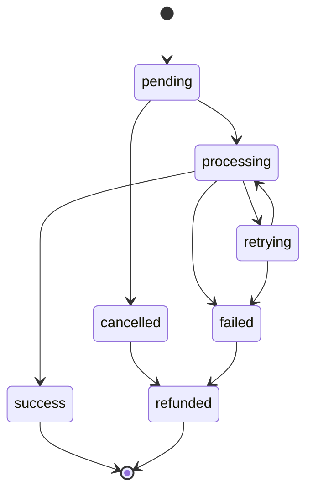
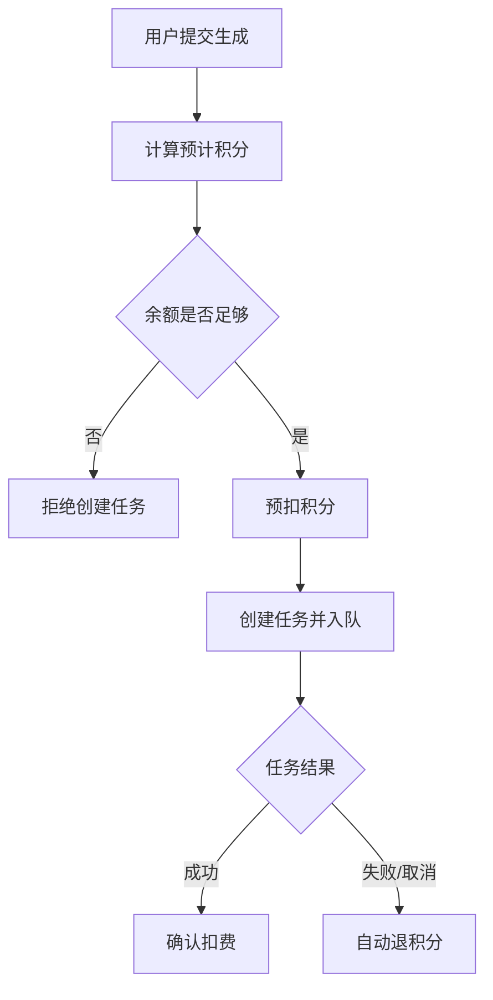

# AI 图片聚合平台 P0 基建优先级

本文档定义当前第一阶段必须优先完成的 6 个核心能力。目标是先把平台从“单人可用”升级为“多人可稳定使用”的基础架构。

## 总览

优先级顺序：

1. Redis + BullMQ 任务队列
2. 对象存储（Cloudflare R2 / S3）
3. 图片任务状态系统
4. 积分扣费系统
5. 调用日志系统
6. 模型渠道管理

当前代码已经具备部分雏形：

- 已有 Redis REST 存储封装：`modules/queue/server/redis-store.ts`
- 已有任务创建、状态、取消、失败退积分逻辑：`modules/billing/server/platform.ts`
- 已有图片 Worker 处理逻辑：`modules/queue/server/image-task-worker.ts`
- 已有模型和渠道后台配置：`modules/admin/components/admin-platform-panel.tsx`
- 但目前队列仍偏轻量，主要是 Redis List + API 触发 Worker，不是完整 BullMQ Worker 架构。
- 图片结果目前仍以外部返回 URL / base64 结果为主，没有统一落入对象存储。

## 1. Redis + BullMQ 任务队列

### 目标

图片生成任务必须异步执行，前端只提交任务并轮询状态，不直接等待模型接口返回。

### 必须能力

- 使用 BullMQ 管理任务队列。
- Redis 作为队列后端。
- 支持并发控制。
- 支持重试次数。
- 支持任务超时。
- 支持失败恢复。
- 支持任务取消。
- 支持 Worker 独立运行。

### 建议目录

```txt
modules/queue/
  server/
    bullmq-connection.ts
    image-queue.ts
    image-worker.ts
    queue-events.ts
    retry-policy.ts
    timeout.ts
  types/
    queue.ts
```

### 验收标准

- `POST /api/workflows/run` 只创建任务并入队。
- Worker 从 BullMQ 消费任务。
- 前端通过 `GET /api/tasks/:taskId` 查询状态。
- 任务失败后根据规则自动重试。
- 最终失败后自动退积分。

## 2. 对象存储（R2 / S3）

### 目标

所有平台内图片资产必须统一保存到对象存储，不能长期依赖第三方模型返回的临时 URL。

### 必须能力

- 上传用户参考图。
- 保存生成结果图。
- 保存缩略图。
- 保存原图和处理后图。
- 生成公开访问 URL 或签名 URL。
- 支持后续迁移 Cloudflare R2、AWS S3、阿里云 OSS、腾讯 COS。

### 建议目录

```txt
modules/assets/
  server/
    object-storage.ts
    r2-storage.ts
    s3-compatible-storage.ts
    image-assets.ts
  types/
    asset.ts
```

### 环境变量

```env
STORAGE_PROVIDER=r2
S3_ENDPOINT=
S3_REGION=auto
S3_BUCKET=
S3_ACCESS_KEY_ID=
S3_SECRET_ACCESS_KEY=
S3_PUBLIC_BASE_URL=
```

### 验收标准

- 本地上传参考图后，模型接口拿到的是公网图片 URL。
- 生成成功后，图片被保存到对象存储。
- 作品历史、收藏、下载都引用平台自己的图片资产 ID。

## 3. 图片任务状态系统

### 目标

每一次生成都是一个明确的任务，有完整生命周期。

### 状态机



### 状态说明

| 状态 | 含义 |
| --- | --- |
| `pending` | 已创建，等待队列消费 |
| `processing` | Worker 正在处理 |
| `retrying` | 失败后等待重试 |
| `success` | 生成成功 |
| `failed` | 最终失败 |
| `cancelled` | 用户取消 |
| `refunded` | 已完成退积分 |

### 验收标准

- 每个任务都能在后台看到完整状态。
- 用户端能看到生成中、成功、失败、取消。
- 任务失败原因可追踪。

## 4. 积分扣费系统

### 目标

图片生成前预扣积分，失败后自动退回。

### 计费维度

- 模型基础积分。
- 模型倍率。
- 分辨率倍率。
- 质量倍率。
- 参考图倍率。
- 功能倍率：文生图、图生图、局部重绘、扩图、高清放大、多图融合、批量生成。
- 生成数量。

### 计费公式

```txt
总积分 =
ceil(
  模型基础积分
  * 模型倍率
  * 分辨率倍率
  * 质量倍率
  * 参考图倍率
  * 功能倍率
  * 生成数量
)
```

### 扣费流程



### 验收标准

- 积分不足不能创建任务。
- 创建任务时立刻扣积分。
- 失败、取消、超时最终失败都会退积分。
- 积分流水可查。

## 5. 调用日志系统

### 目标

所有模型调用、任务流转、扣费退款都必须有日志，方便排查问题和统计成本。

### 日志类型

- `task_created`
- `task_processing`
- `task_retrying`
- `task_success`
- `task_failed`
- `task_cancelled`
- `credits_debited`
- `credits_refunded`
- `provider_request`
- `provider_response`
- `provider_error`
- `asset_uploaded`
- `admin_config_updated`

### 建议字段

```ts
type PlatformLog = {
  id: string;
  type: string;
  userId?: string;
  taskId?: string;
  model?: string;
  channel?: string;
  message: string;
  requestId?: string;
  latencyMs?: number;
  costCredits?: number;
  metadata?: Record<string, unknown>;
  createdAt: string;
};
```

### 验收标准

- 后台能按用户、任务、模型、渠道筛选日志。
- 模型请求失败时能看到 HTTP 状态、错误信息和耗时。
- 不记录 API Key、用户密码等敏感信息。

## 6. 模型渠道管理

### 目标

模型和 API 渠道要后台可配置，不能写死在代码里。

### 管理对象

#### 模型

- 模型 ID
- 展示名称
- 所属渠道
- 是否启用
- 支持功能
- 支持比例
- 支持分辨率
- 支持质量
- 基础积分
- 各维度倍率
- 超时配置
- 重试配置

#### 渠道

- 渠道 ID
- 渠道名称
- Base URL
- 鉴权方式
- 环境变量 Key 名称
- 是否启用
- 优先级
- 限流配置

### 验收标准

- 后台可以启停模型。
- 后台可以修改模型计费倍率。
- 后台可以启停渠道。
- 生成时根据模型找到对应渠道。
- 渠道失败时可扩展备用渠道。

## 推荐落地顺序

### 第 1 步：BullMQ 队列骨架

- 已添加 BullMQ / ioredis / tsx 依赖。
- 已新建队列连接、队列定义、Worker 定义。
- 已保留现有 API 路由行为：配置 `REDIS_URL` 时走 BullMQ；未配置时继续使用本地兜底队列。
- 生产环境需要同时运行 Web 进程和 Worker 进程。

```bash
npm run start
npm run worker:image
```

### 第 2 步：对象存储抽象

- 添加 S3-compatible 存储封装。
- 用户上传参考图后自动落对象存储。
- 生成结果图统一保存到对象存储。

### 第 3 步：任务状态表/存储规范化

- 把任务状态、尝试次数、错误信息、结果资产 ID 标准化。
- 后台任务日志从统一任务存储读取。

### 第 4 步：积分流水标准化

- 拆出 `CreditTransaction`。
- 所有扣费、退款、充值都写流水。

### 第 5 步：调用日志标准化

- 模型请求前后写日志。
- 记录耗时、模型、渠道、任务 ID。

### 第 6 步：模型渠道管理强化

- 把模型能力和渠道能力从代码迁移到后台配置。
- 前端模型选择、比例、分辨率、质量选项从配置读取。

## 暂不做的事

第一阶段先不拆微服务。

暂不引入复杂 Kubernetes、分布式追踪、独立支付网关、企业级权限系统。当前目标是一个 Next.js 模块化单体，先把队列、存储、计费、日志、渠道打扎实。
